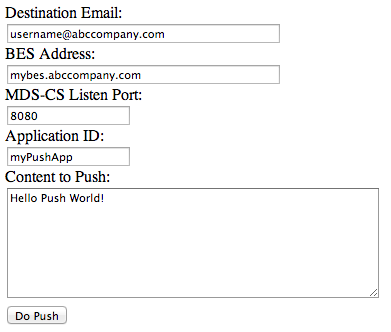

# Push Server Basics

This sample demonstrates how to implement Enterprise BlackBerry Push from the server. Note that any language can be used to build the server push. It is just an HTTP post to the BES. (ie. ASP, JSP, JavaScript, PHP, etc).

## Screenshots ##



1. Copy the index.html file to a webserver.

2. Open http://<your_server>/index.html in a web browser.

3. Fill out the form items.

	```
	Email: The Email of the device you want to push to.

	BES Address: The address of the BES that manages the device. BES Admin may need to be consulted for this.

	MDS-CS Listen Port: Usually 8080, but another item you may need to get from your BES admin

	Application ID: This will match the appId you set in the pushClient.js ops object.

	Content: Any string you would like to push that is under 8 KB.

	```

4. Click Do Push. Content should show on your device.

## Bug Reporting and Feature Requests

If you find a bug in a Sample, or have an enhancement request, simply file an [Issue](https://github.com/blackberry/BES10-WebWorks/issues) for the Sample.

## Disclaimer

THE SOFTWARE IS PROVIDED "AS IS", WITHOUT WARRANTY OF ANY KIND, EXPRESS OR IMPLIED, INCLUDING BUT NOT LIMITED TO THE WARRANTIES OF MERCHANTABILITY, FITNESS FOR A PARTICULAR PURPOSE AND NONINFRINGEMENT. IN NO EVENT SHALL THE AUTHORS OR COPYRIGHT HOLDERS BE LIABLE FOR ANY CLAIM, DAMAGES OR OTHER LIABILITY, WHETHER IN AN ACTION OF CONTRACT, TORT OR OTHERWISE, ARISING FROM, OUT OF OR IN CONNECTION WITH THE SOFTWARE OR THE USE OR OTHER DEALINGS IN THE SOFTWARE.

